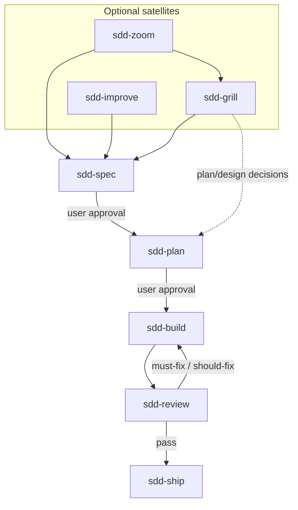

# SDD Skills

Lightweight, platform-neutral skills for spec-driven development.

The repository keeps the useful discipline of SDD without turning it into a
state machine, project manager, or Git workflow framework.

## Core principles

Six principles in three layers — **shape** (what the repo is), **delivery** (how consumers ship increments), **governance** (how maintainers evolve skills).

### Shape

| Principle | In practice |
| --- | --- |
| **Minimal & neutral** | Concise `SKILL.md`; default artifacts spec + plan only; Markdown only — no hooks, slash commands, manifests, mandatory satellites, or runtime state files |
| **Explicit stages** | Install and `@` one skill at a time (see [Skills](#skills) for artifact deps); one stage output → **Stop** → hand off — no auto-chaining or in-session next-stage work |

### Delivery

| Principle | In practice |
| --- | --- |
| **Verifiable slices** | Spec AC; plan as vertical slices (15–60 min), not a Gantt chart; optional grill / zoom / improve only when needed |
| **Test and prove** | `sdd-build`: failing test first; `sdd-review`: read-only, evidence-backed findings; `sdd-ship`: rerun verification, read full output — no completion claims without proof |

### Governance

| Principle | In practice |
| --- | --- |
| **Borrow, don't rebuild** | Pin upstream @ [SOURCES.md](SOURCES.md); verbatim @ pin + minimal SDD tail; fuse ideas — don't mirror upstream catalogs |
| **No empty ceremony** | No new core stages or state fields without consumer evidence; validate skill changes in consumer repos, not maintainer dogfood |

## Workflow



`sdd-grill` may hand off to **`sdd-plan`** when plan or design still needs decisions.

**Explicit stages:** one stage output → **Stop** → hand off; user **`@`** the next skill.

The **core delivery loop** has six stages below. **`sdd-improve`** and **`sdd-zoom`** are optional satellites—install when needed; neither is mandatory before ship.

## Skills

### Core loop

| Skill | Use when |
| --- | --- |
| `sdd-grill` | Goals, boundaries, trade-offs, or plan/design need decisions; user says "grill me" |
| `sdd-spec` | A durable behavior contract and acceptance criteria are needed |
| `sdd-plan` | An approved spec needs testable vertical slices |
| `sdd-build` | An approved plan is ready for test-first implementation |
| `sdd-review` | **Delivery review** — increment diff needs delivery verdict (AC, tests, architecture)—not **opportunity scan** |
| `sdd-ship` | A reviewed increment needs final acceptance evidence |

### Optional satellites

| Skill | Use when |
| --- | --- |
| `sdd-zoom` | Unfamiliar code—need a **territory map** (modules, callers, domain vocabulary); not refactor findings |
| `sdd-improve` | **Opportunity scan** — read-only audit / health check (findings report)—optional; not **delivery review** |

### Artifact dependencies

| Skill | Requires |
| --- | --- |
| `sdd-grill`, `sdd-spec`, `sdd-zoom`, `sdd-improve` | — |
| `sdd-review` | Increment diff (spec/plan improve traceability) |
| `sdd-plan` | Approved spec |
| `sdd-build` | Approved spec + plan |
| `sdd-ship` | Spec + plan + passed review |

Only plan, build, and ship need prior artifacts.

## Installation

Install with the [skills CLI](https://github.com/vercel-labs/skills) (Cursor, Codex, Claude Code, and other supported agents):

```bash
npx skills@latest add zhijunio/sdd-skills
```

The installer detects local agents and prompts for scope. Non-interactive example:

```bash
npx skills@latest add zhijunio/sdd-skills -a cursor -a codex -a claude-code -y
```

Pin the latest **tagged** release (`v0.2.1` — core loop + **`sdd-zoom`**):

```bash
npx skills@latest add zhijunio/sdd-skills@v0.2.1 -a cursor -a codex -a claude-code -y
```

**`sdd-improve`** is in `[Unreleased]` until the next tag — install from the default branch or add by name:

```bash
npx skills@latest add zhijunio/sdd-skills -s sdd-improve -s sdd-zoom -a cursor -y
```

| Scope | Flag | Where skills land |
| --- | --- | --- |
| **Project** (default) | — | `./.agents/skills/` — shared by Cursor and Codex in the same repo |
| **Global** | `-g` | Cursor: `~/.cursor/skills/` · Codex: `~/.codex/skills/` · Claude Code: `~/.claude/skills/` |

Select all six core skills for the full loop, or add optional satellites:

```bash
npx skills@latest add zhijunio/sdd-skills -s sdd-improve -s sdd-zoom -y
```

Minimal core install:

```bash
npx skills@latest add zhijunio/sdd-skills -s sdd-spec -s sdd-plan -y
```

List skills in the repo without installing:

```bash
npx skills@latest add zhijunio/sdd-skills --list
```

**Manual install:** copy `skills/<name>/` into your agent's skills directory (including bundled templates such as `spec-template.md` under `sdd-spec/`).

This repository does not ship platform hooks, slash commands, or agent manifests.

## Minimal Artifacts

Only two documents are required by default:

```text
docs/sdd/YYYY-MM-DD-<topic>-spec.md
docs/sdd/YYYY-MM-DD-<topic>-plan.md
```

Clarify, grill, and review documents are optional. The workflow does not require
status fields or a persistent active-increment file.

Cross-feature architecture decisions may live in `docs/adr/0001-short-title.md`
and be linked from spec **Related ADRs**; that layout is optional and not part
of the default two-document workflow.

Stable domain terminology may live in `CONTEXT.md` at the project root (single
domain) or in `docs/context/<domain>/CONTEXT.md` (multi-domain). Spec **Current Context** records increment facts for this change; reference shared
terms from CONTEXT instead of repeating them. Optional — see
[engineering-rationale §2.5](docs/design/engineering-rationale.md#41-可选-context-与-adr).

## Review Scope

`sdd-review` can run with only a diff. A spec and plan improve traceability but
are optional. It never assumes `main`; the user-specified range or actual task
scope takes precedence.

## Changelog

See [CHANGELOG.md](CHANGELOG.md). `sdd-ship` updates it when user-visible releases require it.

## Design

Implements the [core principles](#core-principles) above. Also:

- Skill instructions English; deliverables follow the user's language; **layout is flexible** (required **content**, not a shared skeleton).
- Spec and plan need user approval before build.

Design docs: [docs/design/](docs/design/) — [engineering-rationale](docs/design/engineering-rationale.md)（本仓 + 上游对照）.

## Sources

The skills synthesize ideas from
[mattpocock/skills](https://github.com/mattpocock/skills),
[obra/superpowers](https://github.com/obra/superpowers), and
[addyosmani/agent-skills](https://github.com/addyosmani/agent-skills).
See [SOURCES.md](SOURCES.md) and
[THIRD_PARTY_NOTICES.md](THIRD_PARTY_NOTICES.md).

## License

MIT
