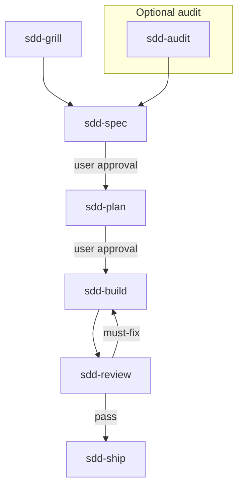

# SDD Skills

[](https://github.com/zhijunio/sdd-skills/actions/workflows/check.yml)
[](LICENSE)

**Thirteen** platform-neutral agent skills in one repo: a **six-stage SDD delivery loop** (plus optional `sdd-grill` and `sdd-audit`), and **six independent utility skills** that are not part of that loop. No state machine, project manager, or Git workflow framework — SDD stages you **`@`** one at a time.

## Why use these skills

- **Explicit stages** — one skill output → **Stop** → hand off; no auto-chaining
- **Verifiable slices** — spec AC, plan as vertical slices, test-first build, evidence-backed review and verify
- **SDD optional** — `sdd-grill` (clarify) and `sdd-audit` (codebase health) only when you need them
- **Independent utilities** — README, AGENTS.md, git isolation, release, explain, onboarding — install separately; no SDD coupling
- **Platform-neutral** — Markdown skills only; works with Cursor, Codex, Claude Code, and other agents via the [skills CLI](https://github.com/vercel-labs/skills)

Six principles (shape / delivery / governance): explicit stages, verifiable slices, test and prove, borrow don't rebuild — embodied in skill `SKILL.md` files and [AGENTS.md](AGENTS.md).

## Getting started

Install from this repository:

```bash
npx skills@latest add zhijunio/sdd-skills
```

Non-interactive (multiple agents):

```bash
npx skills@latest add zhijunio/sdd-skills -a cursor -a codex -a claude-code -y
```

SDD core loop only:

```bash
npx skills@latest add zhijunio/sdd-skills \
  -s sdd-spec -s sdd-plan -s sdd-build -s sdd-review -s sdd-ship \
  -a cursor -y
```

SDD core + optional clarify (`sdd-grill`):

```bash
npx skills@latest add zhijunio/sdd-skills \
  -s sdd-grill -s sdd-spec -s sdd-plan -s sdd-build -s sdd-review -s sdd-ship \
  -a cursor -y
```

Minimal path (spec + plan):

```bash
npx skills@latest add zhijunio/sdd-skills -s sdd-spec -s sdd-plan -y
```

Independent skills only (examples):

```bash
npx skills@latest add zhijunio/sdd-skills -s git-context -a cursor -y
npx skills@latest add zhijunio/sdd-skills -s create-readme -s create-agentsmd -y
```

SDD optional audit:

```bash
npx skills@latest add zhijunio/sdd-skills -s sdd-audit -a cursor -y
```

**Stable pin** (`v0.3.1` — eight skills, pre-rename ids):

```bash
npx skills@latest add zhijunio/sdd-skills@v0.3.1 -a cursor -a codex -a claude-code -y
```

| Scope | Flag | Where skills land |
| --- | --- | --- |
| Project (default) | — | `./.agents/skills/` |
| Global | `-g` | Cursor: `~/.cursor/skills/` · Codex: `~/.codex/skills/` · Claude Code: `~/.claude/skills/` |

List without installing: `npx skills@latest add zhijunio/sdd-skills --list`

**Manual install:** copy `skills/<name>/` into your agent's skills directory (include bundled `references/` where present).

> **Breaking on current `main` (unreleased):** `sdd-verify` → `sdd-ship` (git-release merged in); `sdd-improve` → `sdd-audit`; `sdd-worktree` → `git-context`; `sdd-publish` → `git-release`; `sdd-explain` → `explain-code`; `sdd-onboard` → `onboarding-plan`; `sdd-readme` / `sdd-agents` → `create-readme` / `create-agentsmd`; **`sdd-zoom` removed**. Update `@` references after upgrading from `v0.3.1`.

## SDD workflow



## Skills

Instructions **English**; deliverables follow the user's language (**Present** in each `SKILL.md`).

### SDD delivery loop

| Skill | Use when |
| --- | --- |
| `sdd-spec` | A behavior contract and acceptance criteria are needed |
| `sdd-plan` | An approved spec needs testable vertical slices |
| `sdd-build` | An approved plan is ready for test-first implementation |
| `sdd-review` | An increment diff needs a delivery verdict |
| `sdd-ship` | Verify and ship a reviewed increment — from evidence through merged PR |

### SDD optional

| Skill | Use when |
| --- | --- |
| `sdd-grill` | Goals, boundaries, or trade-offs need decisions before spec or plan |
| `sdd-audit` | Repo or branch health scan for follow-ups — not a delivery gate |

**Review vs audit:** `sdd-review` gates **this increment**; `sdd-audit` scans the **repo or branch** for follow-ups only. Do not substitute one for the other — see **When/Skip** links in each skill.

### Independent (not SDD)

Bundled in this repo for convenience; **no SDD loop coupling** — `@` only when you need the task.

| Skill | Use when |
| --- | --- |
| `create-readme` | Human-facing README.md for a project |
| `create-agentsmd` | AGENTS.md for agent operating context |
| `explain-code` | Explain code in chat |
| `git-context` | Isolated git context (worktree or topic branch) before coding |
| `onboarding-plan` | Phased contributor onboarding plan |

Paired GitHub prompts under [`.github/prompts/`](.github/prompts/) — independent files, content aligned with skills below (no cross-links between skill and prompt).

| Skill | Paired prompt |
| --- | --- |
| `sdd-grill` | `grill-me.prompt.md` |
| `create-readme` | `create-readme.prompt.md` |
| `create-agentsmd` | `create-agentsmd.prompt.md` |
| `explain-code` | `explain-code.prompt.md` |
| `onboarding-plan` | `onboarding-plan.prompt.md` |

`git-context` has no paired prompt.

**Prompt-only** (no skill):

| Prompt | Prefer skill when |
| --- | --- |
| `review-code.prompt.md` | Increment delivery gate → `sdd-review` |
| `document-api.prompt.md` | Behavior contract / AC → `sdd-spec` |
| `generate-unit-tests.prompt.md` | Test-first on approved plan → `sdd-build` |
 | `git-release.prompt.md` | Push & PR lifecycle → `sdd-ship` |

### Consumer artifacts

Default documents in **your** project:

```text
docs/sdd/YYYY-MM-DD-<topic>-spec.md
docs/sdd/YYYY-MM-DD-<topic>-plan.md
```

Optional: `docs/adr/`, `CONTEXT.md` for stable domain language in consumer projects.

## Documentation

| Topic | Link |
| --- | --- |
| Agent operating guide | [AGENTS.md](AGENTS.md) |
| Maintainer SDD archives | [docs/sdd/README.md](docs/sdd/README.md) |
| Contributor onboarding | [`onboarding-plan`](skills/onboarding-plan/SKILL.md) skill · [prompt](.github/prompts/onboarding-plan.prompt.md) |
| Release history | [CHANGELOG.md](CHANGELOG.md) |

## Contributing

Maintainers: read [AGENTS.md](AGENTS.md). Open PRs to `main`; CI job **`validate`** must pass (twelve skills, `sdd-ship` present). User-visible changes → [CHANGELOG.md](CHANGELOG.md) `[Unreleased]`.

## Sources

Ideas from [mattpocock/skills](https://github.com/mattpocock/skills), [obra/superpowers](https://github.com/obra/superpowers), [addyosmani/agent-skills](https://github.com/addyosmani/agent-skills), and [shadcn/improve](https://github.com/shadcn/improve) (audit influence for **`sdd-audit`**).

## License

MIT — see [LICENSE](LICENSE).
