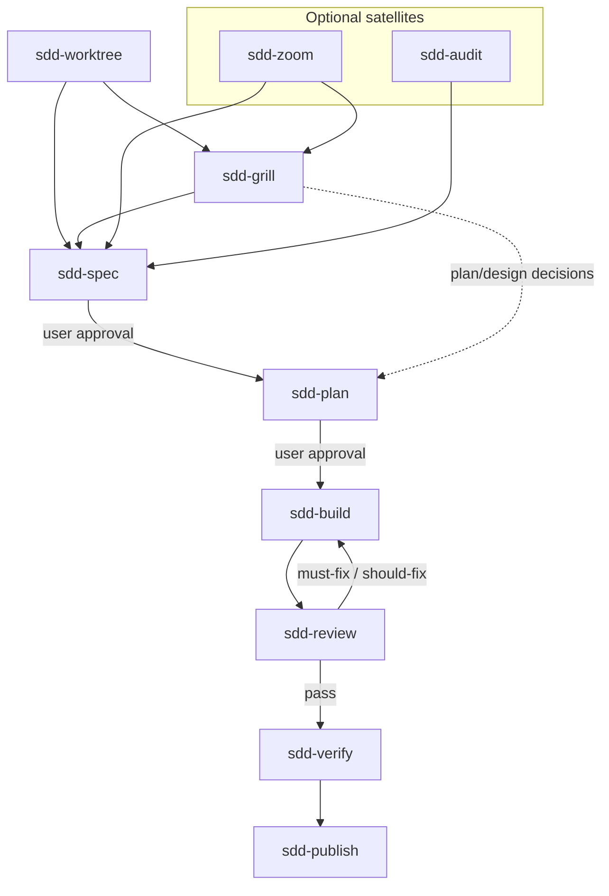

# SDD Skills

Lightweight, platform-neutral skills for spec-driven development — **ten skills**, six-stage delivery loop, four optional satellites (one pre-loop, one post-loop).

The repository keeps useful SDD discipline without a state machine, project manager, or Git workflow framework.

## Core principles

Six principles in three layers — **shape** (what the repo is), **delivery** (how consumers ship increments), **governance** (how maintainers evolve skills). 中文展开见 [engineering-rationale §1.0](docs/design/engineering-rationale.md#10-核心原则).

### Shape

| Principle | In practice |
| --- | --- |
| **Minimal & neutral** | Concise `SKILL.md`; default artifacts spec + plan only; Markdown only — no hooks, slash commands, manifests, mandatory satellites, or runtime state files |
| **Explicit stages** | Install and `@` one skill at a time (see [Skills](#skills)); one stage output → **Stop** → hand off — no auto-chaining or in-session next-stage work |

### Delivery

| Principle | In practice |
| --- | --- |
| **Verifiable slices** | Spec AC; plan as vertical slices (15–60 min), not a Gantt chart; optional grill / zoom / audit only when needed |
| **Test and prove** | `sdd-build`: failing test first; `sdd-review`: read-only, evidence-backed findings; `sdd-verify`: rerun verification, read full output — no completion claims without proof |

### Governance

| Principle | In practice |
| --- | --- |
| **Borrow, don't rebuild** | Pin upstream @ [SOURCES.md](SOURCES.md); verbatim @ pin + minimal SDD tail; fuse ideas — don't mirror upstream catalogs |
| **No empty ceremony** | No new core stages or state fields without consumer evidence; validate **material** skill changes by spot-checking in consumer repos |

## Workflow



**Explicit stages:** one stage output → **Stop** → hand off; user **`@`** the next skill.

- **`sdd-worktree`** — optional **pre-loop** git isolation (worktree or topic branch) before spec; experimental until [CHANGELOG](CHANGELOG.md) spot-check passes.
- **`sdd-grill`** — optional clarify before spec or plan (one question at a time); may hand off to **`sdd-plan`** when plan/design still needs decisions.
- **`sdd-zoom`** / **`sdd-audit`** — optional satellites; neither is mandatory before verify.
- **`sdd-publish`** — optional **post-loop** remote integration (push / PR / merge / tag / release); standalone `@` OK, does not require `@sdd-verify`; experimental until spot-check in [CHANGELOG](CHANGELOG.md).

## Skills

Ten skills under `skills/<name>/`. Instructions **English**; deliverables follow the user's language (**Present** hard rule in each `SKILL.md`).

### Core loop

| Skill | Use when |
| --- | --- |
| `sdd-grill` | Goals, boundaries, trade-offs, or plan/design need decisions; user says "grill me" |
| `sdd-spec` | A durable behavior contract and acceptance criteria are needed |
| `sdd-plan` | An approved spec needs testable vertical slices |
| `sdd-build` | An approved plan is ready for test-first implementation |
| `sdd-review` | **Delivery review** — increment diff needs delivery verdict (AC, tests, architecture) |
| `sdd-verify` | A reviewed increment needs final acceptance evidence |

### Optional satellites

| Skill | Use when |
| --- | --- |
| `sdd-worktree` | **Pre-loop** — isolate git context (worktree or topic branch) before spec; experimental until spot-check in [CHANGELOG](CHANGELOG.md) |
| `sdd-publish` | **Post-loop** — remote integration; per-step Present + confirm; no `@sdd-verify` prerequisite; experimental until spot-check in [CHANGELOG](CHANGELOG.md) |
| `sdd-zoom` | Unfamiliar code — **territory map** (modules, callers, domain vocabulary); not refactor findings |
| `sdd-audit` | **Codebase audit** — same MECE model as `codebase-audit`; P0/P1/P2 roadmap; SDD handoff in **Suggested next steps**; not **delivery review** |

### Review vs audit

| | `sdd-review` | `sdd-audit` |
| --- | --- | --- |
| Question | Can **this increment** ship? | What opportunities exist in the **repo or branch**? |
| Scope | Increment diff | Whole repo or branch vs merge-base |
| Outcome | Delivery verdict + lens ids | Findings + roadmap; handoff in **Suggested next steps** |
| Severity | Delivery **🔴/🟡/🟢** groups (verify gate) | Impact **🚨/🔴/🟡/🟢** per finding + **P0/P1/P2** text |

Pairing is **When/Skip** cross-links in each skill — do not substitute one for the other. Ambiguous "review" without a diff → ask which skill.

### Artifact dependencies

| Skill | Requires |
| --- | --- |
| `sdd-worktree`, `sdd-grill`, `sdd-spec`, `sdd-zoom`, `sdd-audit` | — |
| `sdd-review` | Increment diff (spec/plan improve traceability) |
| `sdd-plan` | Approved spec |
| `sdd-build` | Approved spec + plan |
| `sdd-verify` | Spec + plan + passed review |
| `sdd-publish` | User integration intent (push / PR / merge / tag / release) |

Only plan, build, and verify need prior artifacts. **`sdd-review`** can run with diff only; it never assumes `main` — user-specified range or task scope wins.

## Installation

Install with the [skills CLI](https://github.com/vercel-labs/skills) (Cursor, Codex, Claude Code, and other supported agents):

```bash
npx skills@latest add zhijunio/sdd-skills
```

Non-interactive example:

```bash
npx skills@latest add zhijunio/sdd-skills -a cursor -a codex -a claude-code -y
```

**Default branch** — ten skills (includes experimental **`sdd-worktree`** and **`sdd-publish`**); see [Unreleased](CHANGELOG.md#unreleased).

**Recommended pin** — latest tagged release (`v0.3.1`, eight skills — bump pin when tagging a release that includes new satellites):

```bash
npx skills@latest add zhijunio/sdd-skills@v0.3.1 -a cursor -a codex -a claude-code -y
```

Older pin (`v0.2.1` — six core loop + **`sdd-zoom`** only):

```bash
npx skills@latest add zhijunio/sdd-skills@v0.2.1 -a cursor -a codex -a claude-code -y
```

Add by name from default branch:

```bash
npx skills@latest add zhijunio/sdd-skills \
  -s sdd-grill -s sdd-spec -s sdd-plan -s sdd-build -s sdd-review -s sdd-verify \
  -s sdd-audit -s sdd-zoom -a cursor -y
```

| Scope | Flag | Where skills land |
| --- | --- | --- |
| **Project** (default) | — | `./.agents/skills/` |
| **Global** | `-g` | Cursor: `~/.cursor/skills/` · Codex: `~/.codex/skills/` · Claude Code: `~/.claude/skills/` |

Minimal path (spec + plan only):

```bash
npx skills@latest add zhijunio/sdd-skills -s sdd-spec -s sdd-plan -y
```

Add satellites only:

```bash
npx skills@latest add zhijunio/sdd-skills \
  -s sdd-worktree -s sdd-publish -s sdd-audit -s sdd-zoom -y
```

List without installing: `npx skills@latest add zhijunio/sdd-skills --list`

**Manual install:** copy `skills/<name>/` into your agent's skills directory (include bundled templates under `sdd-spec/`, `sdd-plan/`, and `references/` for audit/review).

No platform hooks, slash commands, or agent manifests in this repository.

## Minimal artifacts

Default consumer documents:

```text
docs/sdd/YYYY-MM-DD-<topic>-spec.md
docs/sdd/YYYY-MM-DD-<topic>-plan.md
```

Grill, zoom, audit, and review outputs stay in conversation unless the user asks to persist. No status fields or active-increment file required.

Optional cross-feature decisions: `docs/adr/0001-short-title.md` (link from spec **Related ADRs**). Optional domain terms: `CONTEXT.md` or `docs/context/<domain>/CONTEXT.md` — see [engineering-rationale §2.5](docs/design/engineering-rationale.md#41-可选-context-与-adr).

## Maintainer verification

**No** `tests/check.py`. Minimal CI **`validate`** (`.github/workflows/check.yml`) counts ten skills on PRs to `main` — branch protection only.

Before merge:

1. Ten skills under `skills/*/SKILL.md`; CI **`validate`** passes.
2. **`sdd-audit`** / **`sdd-review`** references intact.
3. Spot-check Markdown links you edit.
4. **Material** behavior changes → spot-check in a consumer repo; note friction in PR or [CHANGELOG.md](CHANGELOG.md) `[Unreleased]` when user-visible.

Full maintainer guidelines: [AGENTS.md](AGENTS.md). Design rationale: [engineering-rationale.md](docs/design/engineering-rationale.md).

## Changelog

[CHANGELOG.md](CHANGELOG.md) — `sdd-verify` updates it when user-visible releases require it.

## Sources

Ideas from [mattpocock/skills](https://github.com/mattpocock/skills), [obra/superpowers](https://github.com/obra/superpowers), [addyosmani/agent-skills](https://github.com/addyosmani/agent-skills), and [shadcn/improve](https://github.com/shadcn/improve) (audit checklist for **`sdd-audit`**).

Pin mapping and per-skill decisions: [SOURCES.md](SOURCES.md) · [THIRD_PARTY_NOTICES.md](THIRD_PARTY_NOTICES.md)

## License

MIT
