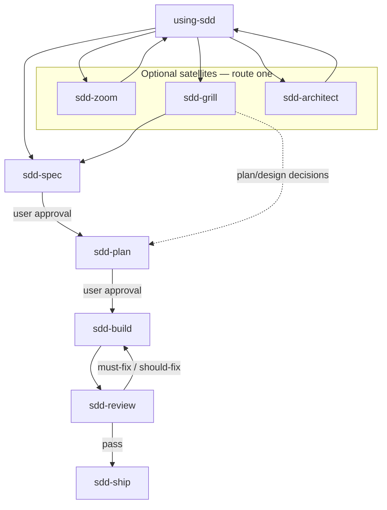

# SDD Skills

Lightweight, platform-neutral skills for spec-driven development.

The repository keeps the useful discipline of SDD without turning it into a
state machine, project manager, or Git workflow framework.

## Workflow



`sdd-grill` may route to **`sdd-plan`** when plan or design still needs decisions (see [using-sdd — Routing matrix](skills/using-sdd/SKILL.md#routing-matrix)).

Each skill stops after its own output. Skills recommend the next stage but do
not invoke it automatically.

The **core delivery loop** has seven stages below. **`sdd-architect`** and **`sdd-zoom`** are optional satellites—install when needed; neither is mandatory before ship.

## Skills

### Core loop

| Skill | Use when |
| --- | --- |
| `using-sdd` | The correct SDD stage is unclear |
| `sdd-grill` | Goals, boundaries, trade-offs, or plan/design need decisions; user says "grill me" |
| `sdd-spec` | A durable behavior contract and acceptance criteria are needed |
| `sdd-plan` | An approved spec needs testable vertical slices |
| `sdd-build` | An approved plan is ready for test-first implementation |
| `sdd-review` | A **defined diff** needs independent delivery review (defects, AC, tests)—not a whole-repo architecture scan |
| `sdd-ship` | A reviewed increment needs final acceptance evidence |

### Optional satellites

| Skill | Use when |
| --- | --- |
| `sdd-zoom` | Unfamiliar code—need a **territory map** (modules, callers, domain vocabulary); not refactor advice |
| `sdd-architect` | Pre-spec **architecture opportunity scan** (shallow modules, seams, mud-ball)—optional; not delivery review |

All core skills can be installed independently. Some require artifacts rather
than other skills: `sdd-plan` needs an approved spec, `sdd-build` needs a spec
and plan, and `sdd-ship` needs a passed review.

## Quick routing

| If… | Start with |
| --- | --- |
| Unsure which stage fits | `using-sdd` |
| User already named a stage skill | Honor it — see [using-sdd — User named a stage](skills/using-sdd/SKILL.md#user-named-a-stage) |

**Normative routing** (pre-spec, core loop, review loop, escalation, disambiguation): [using-sdd — Routing matrix](skills/using-sdd/SKILL.md#routing-matrix).

Satellite summary: territory map → `sdd-zoom`; architecture deepening → `sdd-architect`; delivery diff review → `sdd-review`.

## Installation

Install with the [skills CLI](https://github.com/vercel-labs/skills) (Cursor, Codex, Claude Code, and other supported agents):

```bash
npx skills@latest add zhijunio/sdd-skills
```

The installer detects local agents and prompts for scope. Non-interactive example:

```bash
npx skills@latest add zhijunio/sdd-skills -a cursor -a codex -a claude-code -y
```

Pin a validated release (recommended after **`v0.2.1`** — CI on `main`):

```bash
npx skills@latest add zhijunio/sdd-skills@v0.2.1 -a cursor -a codex -a claude-code -y
```

| Scope | Flag | Where skills land |
| --- | --- | --- |
| **Project** (default) | — | `./.agents/skills/` — shared by Cursor and Codex in the same repo |
| **Global** | `-g` | Cursor: `~/.cursor/skills/` · Codex: `~/.codex/skills/` · Claude Code: `~/.claude/skills/` |

Select all seven core skills for the full loop, or add optional satellites:

```bash
npx skills@latest add zhijunio/sdd-skills -s sdd-architect -s sdd-zoom -y
```

If you previously installed **`sdd-deepen`**, remove that directory and reinstall with **`-s sdd-architect`** (same satellite, renamed pre-`v0.2.0`).

Minimal core install:

```bash
npx skills@latest add zhijunio/sdd-skills -s using-sdd -s sdd-spec -y
```

List skills in the repo without installing:

```bash
npx skills@latest add zhijunio/sdd-skills --list
```

**Manual install:** copy `skills/<name>/` into your agent's skills directory (including bundled templates such as `spec-template.md` under `sdd-spec/`).

This repository does not ship platform hooks, slash commands, or agent manifests.

## Minimal Artifacts

Only two documents are required by default:

```text
docs/sdd/YYYY-MM-DD-<topic>-spec.md
docs/sdd/YYYY-MM-DD-<topic>-plan.md
```

Clarify, grill, and review documents are optional. The workflow does not require
status fields or a persistent active-increment file.

Cross-feature architecture decisions may live in `docs/adr/0001-short-title.md`
and be linked from spec **Related ADRs**; that layout is optional and not part
of the default two-document workflow.

Stable domain terminology may live in `CONTEXT.md` at the project root (single
domain) or in `CONTEXT-MAP.md` pointing to per-domain `CONTEXT.md` files.
Spec **Current Context** records increment facts for this change; reference shared
terms from CONTEXT instead of repeating them. Optional — see
[context-adr-workflow](docs/design/context-adr-workflow.md).

## Review Scope

`sdd-review` can run with only a diff. A spec and plan improve traceability but
are optional. It never assumes `main`; the user-specified range or actual task
scope takes precedence.

## Changelog

See [CHANGELOG.md](CHANGELOG.md). `sdd-ship` updates it when user-visible releases require it.

## Validation

```bash
python3 tests/check.py
```

The check validates the skill directories, frontmatter, required sections,
templates, and local links without third-party Python dependencies.

## Design

- No commands, hooks, personas, or platform-specific manifests.
- No runtime status machine.
- No automatic stage chaining.
- No required worktrees or per-slice commits.
- Spec and plan require explicit user approval.
- Review stays read-only.
- Ship verifies; it does not silently publish.

Design docs: [docs/design/](docs/design/) — [project-decisions](docs/design/project-decisions.md) · [Methodology](docs/design/software-engineering-rationale.md) · [Upstream](docs/design/upstream-engineering-rationale.md).

## Sources

The skills synthesize ideas from
[mattpocock/skills](https://github.com/mattpocock/skills),
[obra/superpowers](https://github.com/obra/superpowers), and
[addyosmani/agent-skills](https://github.com/addyosmani/agent-skills).
See [SOURCES.md](SOURCES.md) and
[THIRD_PARTY_NOTICES.md](THIRD_PARTY_NOTICES.md).

## License

MIT

