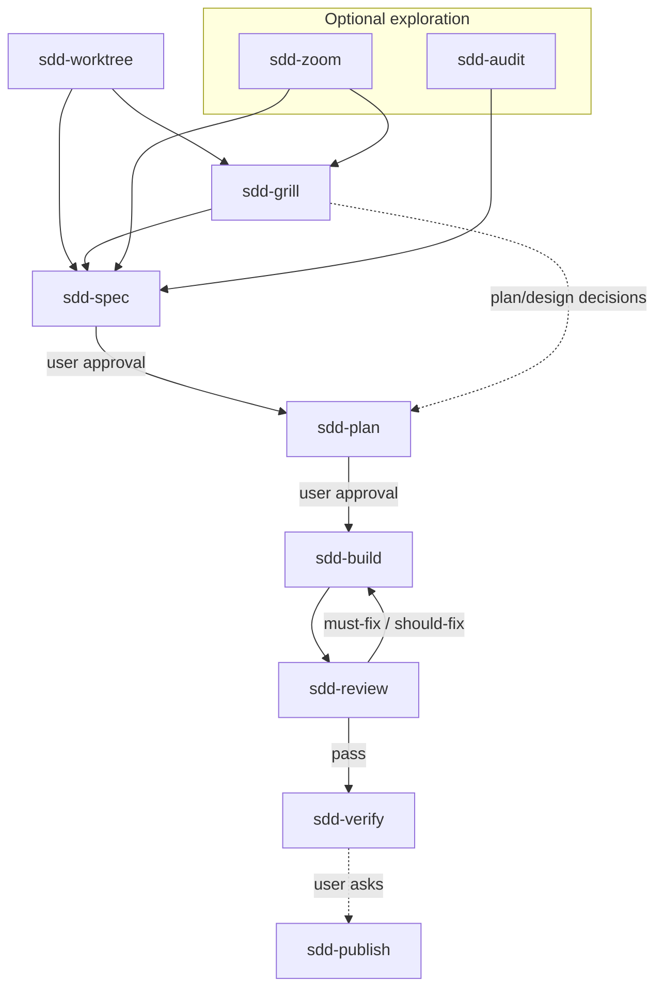

# SDD Skills

[](https://github.com/zhijunio/sdd-skills/actions/workflows/check.yml)
[](LICENSE)

Lightweight, platform-neutral skills for spec-driven development — **fourteen skills**, a six-stage delivery loop, and optional satellites you install only when needed.

The repository keeps useful SDD discipline without a state machine, project manager, or Git workflow framework.

## Core principles

Six principles in three layers — **shape** (what the repo is), **delivery** (how consumers ship increments), **governance** (how maintainers evolve skills). 中文展开见 [engineering-rationale §1.0](docs/design/engineering-rationale.md#10-核心原则).

### Shape

| Principle | In practice |
| --- | --- |
| **Minimal & neutral** | Concise `SKILL.md`; default artifacts spec + plan only; Markdown only — no hooks, slash commands, manifests, mandatory satellites, or runtime state files |
| **Explicit stages** | Install and `@` one skill at a time (see [Skills](#skills)); one stage output → **Stop** → hand off — no auto-chaining or in-session next-stage work |

### Delivery

| Principle | In practice |
| --- | --- |
| **Verifiable slices** | Spec AC; plan as vertical slices (15–60 min), not a Gantt chart; optional grill / zoom / audit only when needed |
| **Test and prove** | `sdd-build`: failing test first; `sdd-review`: read-only, evidence-backed findings; `sdd-verify`: rerun verification, read full output — no completion claims without proof |

### Governance

| Principle | In practice |
| --- | --- |
| **Borrow, don't rebuild** | Pin upstream @ [SOURCES.md](docs/design/SOURCES.md); verbatim @ pin + minimal SDD tail; fuse ideas — don't mirror upstream catalogs |
| **No empty ceremony** | No new core stages or state fields without evidence; validate **material** skill changes by maintainer self-trial |

## Workflow



**Explicit stages:** one stage output → **Stop** → hand off; user **`@`** the next skill.

- **`sdd-worktree`** — optional git isolation before new work (worktree or topic branch).
- **`sdd-grill`** — optional clarify before spec or plan (one question at a time).
- **`sdd-zoom`** / **`sdd-audit`** — optional exploration; neither is mandatory before verify.
- **`sdd-publish`** — optional remote integration (push / PR / merge / tag / release); user `@` explicitly; not part of verify itself.

## Skills

Fourteen skills under `skills/<name>/`. Instructions **English**; deliverables follow the user's language (**Present** hard rule in each `SKILL.md`).

### Core loop

| Skill | Use when |
| --- | --- |
| `sdd-grill` | Goals, boundaries, trade-offs, or plan/design need decisions; user says "grill me" |
| `sdd-spec` | A durable behavior contract and acceptance criteria are needed |
| `sdd-plan` | An approved spec needs testable vertical slices |
| `sdd-build` | An approved plan is ready for test-first implementation |
| `sdd-review` | **Delivery review** — increment diff needs delivery verdict (AC, tests, architecture) |
| `sdd-verify` | A reviewed increment needs final acceptance evidence |

### Loop satellites

| Skill | Use when |
| --- | --- |
| `sdd-worktree` | New work needs an isolated git context before spec or implementation |
| `sdd-publish` | User requests push, PR, merge, tag, or release |

### Exploration satellites

| Skill | Use when |
| --- | --- |
| `sdd-zoom` | Unfamiliar code — **territory map** (modules, callers, domain vocabulary) |
| `sdd-audit` | **Opportunity scan** — read-only codebase or branch health audit |

### Meta satellites

| Skill | Use when |
| --- | --- |
| `sdd-readme` | Creating or revising `README.md` for human onboarding |
| `sdd-agents` | Creating or revising `AGENTS.md` for agent operating guides |
| `sdd-explain` | Explaining selected code or snippets |
| `sdd-onboard` | Phased onboarding plan for new contributors |

Aligned GitHub prompts live under [`.github/prompts/`](.github/prompts/) for several meta and exploration skills.

### Review vs audit

| | `sdd-review` | `sdd-audit` |
| --- | --- | --- |
| Question | Can **this increment** ship? | What opportunities exist in the **repo or branch**? |
| Scope | Increment diff | Whole repo or branch vs merge-base |
| Outcome | Delivery verdict | Findings report + next-stage route |
| 🔴🟡🟢 | **Blocks verify** for this increment | **Follow-up priority** only |

Pairing is **When/Skip** cross-links in each skill — do not substitute one for the other. Ambiguous "review" without a diff → ask which skill.

### Artifact dependencies

| Skill | Requires |
| --- | --- |
| `sdd-grill`, `sdd-spec`, `sdd-zoom`, `sdd-audit`, meta satellites | — |
| `sdd-review` | Increment diff (spec/plan improve traceability) |
| `sdd-plan` | Approved spec |
| `sdd-build` | Approved spec + plan |
| `sdd-verify` | Spec + plan + passed review |

Only plan, build, and verify need prior artifacts. **`sdd-review`** can run with diff only; it never assumes `main` — user-specified range or task scope wins.

## Installation

Install with the [skills CLI](https://github.com/vercel-labs/skills) (Cursor, Codex, Claude Code, and other supported agents):

```bash
npx skills@latest add zhijunio/sdd-skills
```

Non-interactive example (all agents):

```bash
npx skills@latest add zhijunio/sdd-skills -a cursor -a codex -a claude-code -y
```

**Stable pin** — latest tagged release (`v0.3.1`, eight skills; pre-rename names):

```bash
npx skills@latest add zhijunio/sdd-skills@v0.3.1 -a cursor -a codex -a claude-code -y
```

Add core loop only:

```bash
npx skills@latest add zhijunio/sdd-skills \
  -s sdd-grill -s sdd-spec -s sdd-plan -s sdd-build -s sdd-review -s sdd-verify \
  -a cursor -y
```

Minimal path (spec + plan only):

```bash
npx skills@latest add zhijunio/sdd-skills -s sdd-spec -s sdd-plan -y
```

| Scope | Flag | Where skills land |
| --- | --- | --- |
| **Project** (default) | — | `./.agents/skills/` |
| **Global** | `-g` | Cursor: `~/.cursor/skills/` · Codex: `~/.codex/skills/` · Claude Code: `~/.claude/skills/` |

List without installing: `npx skills@latest add zhijunio/sdd-skills --list`

**Manual install:** copy `skills/<name>/` into your agent's skills directory (include bundled templates under `sdd-spec/references/`, `sdd-plan/references/`, and `references/` for audit/review).

No platform hooks, slash commands, or agent manifests in this repository.

> **Breaking (unreleased on `main`):** `sdd-ship` → `sdd-verify`; `sdd-improve` → `sdd-audit`. Update `@` references after upgrading from `v0.3.1`.

## Minimal artifacts

Default consumer documents:

```text
docs/sdd/YYYY-MM-DD-<topic>-spec.md
docs/sdd/YYYY-MM-DD-<topic>-plan.md
```

Grill, zoom, audit, and review outputs stay in conversation unless the user asks to persist. No status fields or active-increment file required.

Optional cross-feature decisions: `docs/adr/0001-short-title.md` (link from spec **Related ADRs**). Optional domain terms: `CONTEXT.md` or `docs/context/<domain>/CONTEXT.md` — see [engineering-rationale §2.3](docs/design/engineering-rationale.md#23-知识分层消费者项目).

## Maintainer verification

Minimal CI **`validate`** (`.github/workflows/check.yml`) on PRs and pushes to `main` — fourteen skills present, `sdd-verify` present, `sdd-ship` absent.

Before merge:

1. Fourteen skills under `skills/*/SKILL.md`; CI **`validate`** passes.
2. Cross-skill references in `sdd-audit/` / `sdd-review/` references intact.
3. Spot-check Markdown links you edit.
4. **Material** behavior changes → maintainer self-trial; note friction in PR or [CHANGELOG.md](CHANGELOG.md) `[Unreleased]` when user-visible.

Design rationale: [engineering-rationale.md](docs/design/engineering-rationale.md) · maintainer design index: [docs/design/README.md](docs/design/README.md)

## Changelog

[CHANGELOG.md](CHANGELOG.md) — `sdd-verify` updates it when user-visible releases require it.

## Sources

Ideas from [mattpocock/skills](https://github.com/mattpocock/skills), [obra/superpowers](https://github.com/obra/superpowers), [addyosmani/agent-skills](https://github.com/addyosmani/agent-skills), and [shadcn/improve](https://github.com/shadcn/improve) (audit checklist influence for **`sdd-audit`**).

Pin mapping and per-skill decisions: [SOURCES.md](docs/design/SOURCES.md) · [THIRD_PARTY_NOTICES.md](docs/design/THIRD_PARTY_NOTICES.md)

## License

MIT — see [LICENSE](LICENSE).
