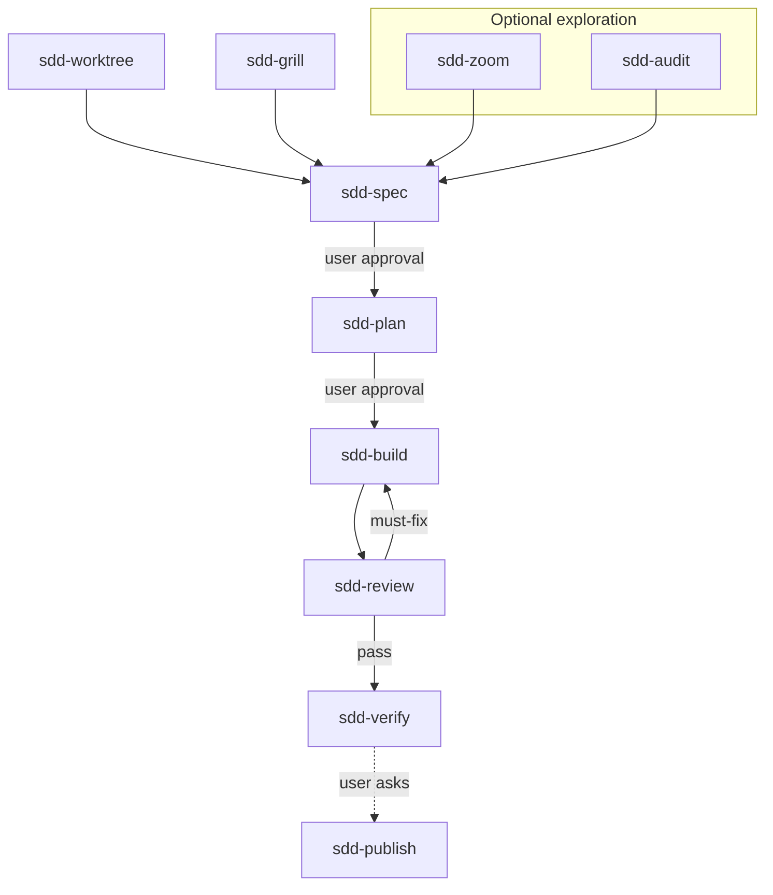

# SDD Skills

[](https://github.com/zhijunio/sdd-skills/actions/workflows/check.yml)
[](LICENSE)

Lightweight, platform-neutral **agent skills** for spec-driven development — fourteen skills, a six-stage delivery loop, and optional satellites you install only when needed. No state machine, project manager, or Git workflow framework — just explicit stages you **`@`** one at a time.

## Why use these skills

- **Explicit stages** — one skill output → **Stop** → hand off; no auto-chaining
- **Verifiable slices** — spec AC, plan as vertical slices, test-first build, evidence-backed review and verify
- **Optional satellites** — worktree isolation, publish, zoom, audit, and meta skills (README, AGENTS, explain, onboard) only when you need them
- **Platform-neutral** — Markdown skills only; works with Cursor, Codex, Claude Code, and other agents via the [skills CLI](https://github.com/vercel-labs/skills)

Six principles (shape / delivery / governance): [engineering-rationale §1.0](docs/design/engineering-rationale.md#10-核心原则).

## Getting started

Install from this repository:

```bash
npx skills@latest add zhijunio/sdd-skills
```

Non-interactive (multiple agents):

```bash
npx skills@latest add zhijunio/sdd-skills -a cursor -a codex -a claude-code -y
```

Core loop only:

```bash
npx skills@latest add zhijunio/sdd-skills \
  -s sdd-grill -s sdd-spec -s sdd-plan -s sdd-build -s sdd-review -s sdd-verify \
  -a cursor -y
```

Minimal path (spec + plan):

```bash
npx skills@latest add zhijunio/sdd-skills -s sdd-spec -s sdd-plan -y
```

**Stable pin** (`v0.3.1` — eight skills, pre-rename ids):

```bash
npx skills@latest add zhijunio/sdd-skills@v0.3.1 -a cursor -a codex -a claude-code -y
```

| Scope | Flag | Where skills land |
| --- | --- | --- |
| Project (default) | — | `./.agents/skills/` |
| Global | `-g` | Cursor: `~/.cursor/skills/` · Codex: `~/.codex/skills/` · Claude Code: `~/.claude/skills/` |

List without installing: `npx skills@latest add zhijunio/sdd-skills --list`

**Manual install:** copy `skills/<name>/` into your agent's skills directory (include bundled `references/` where present).

> **Breaking on current `main` (unreleased):** `sdd-ship` → `sdd-verify`; `sdd-improve` → `sdd-audit`. Update `@` references after upgrading from `v0.3.1`.

## Workflow



## Skills

Instructions **English**; deliverables follow the user's language (**Present** in each `SKILL.md`).

### Core loop

| Skill | Use when |
| --- | --- |
| `sdd-grill` | Goals, boundaries, or trade-offs need decisions before spec or plan |
| `sdd-spec` | A behavior contract and acceptance criteria are needed |
| `sdd-plan` | An approved spec needs testable vertical slices |
| `sdd-build` | An approved plan is ready for test-first implementation |
| `sdd-review` | An increment diff needs a delivery verdict |
| `sdd-verify` | A reviewed increment needs final acceptance evidence |

### Satellites

| Group | Skills |
| --- | --- |
| Loop | `sdd-worktree`, `sdd-publish` |
| Exploration | `sdd-zoom`, `sdd-audit` |
| Meta | `sdd-readme`, `sdd-agents`, `sdd-explain`, `sdd-onboard` |

**Review vs audit:** `sdd-review` gates **this increment**; `sdd-audit` scans the **repo or branch** for follow-ups only. Do not substitute one for the other — see **When/Skip** links in each skill.

Paired GitHub prompts under [`.github/prompts/`](.github/prompts/) — independent files, content aligned with several skills (see [SOURCES — Skill and prompt pairs](docs/design/SOURCES.md#skill-and-prompt-pairs)).

### Consumer artifacts

Default documents in **your** project:

```text
docs/sdd/YYYY-MM-DD-<topic>-spec.md
docs/sdd/YYYY-MM-DD-<topic>-plan.md
```

Optional: `docs/adr/`, `CONTEXT.md` — see [engineering-rationale §2.3](docs/design/engineering-rationale.md#23-知识分层消费者项目).

## Documentation

| Topic | Link |
| --- | --- |
| Design rationale (中文) | [engineering-rationale.md](docs/design/engineering-rationale.md) |
| Upstream pins | [SOURCES.md](docs/design/SOURCES.md) |
| Maintainer design index | [docs/design/README.md](docs/design/README.md) |
| Agent operating guide | [AGENTS.md](AGENTS.md) |
| Contributor onboarding | [docs/ONBOARDING.md](docs/ONBOARDING.md) |
| Release history | [CHANGELOG.md](CHANGELOG.md) |

## Contributing

Maintainers: read [AGENTS.md](AGENTS.md) and [docs/ONBOARDING.md](docs/ONBOARDING.md). Open PRs to `main`; CI job **`validate`** must pass (fourteen skills, `sdd-verify` present). User-visible changes → [CHANGELOG.md](CHANGELOG.md) `[Unreleased]`.

## Sources

Ideas from [mattpocock/skills](https://github.com/mattpocock/skills), [obra/superpowers](https://github.com/obra/superpowers), [addyosmani/agent-skills](https://github.com/addyosmani/agent-skills), and [shadcn/improve](https://github.com/shadcn/improve) (audit influence for **`sdd-audit`**). Details: [SOURCES.md](docs/design/SOURCES.md) · [THIRD_PARTY_NOTICES.md](docs/design/THIRD_PARTY_NOTICES.md).

## License

MIT — see [LICENSE](LICENSE).
